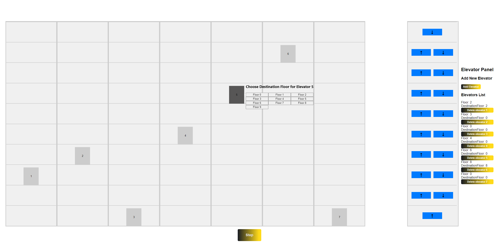

# Elevator-System

## Description
Project consists of:
#### Spring
Backend implemented with Java using Spring.
#### React
Simple frontend application presenting prepared functionalities.

## How to run
I have prepared docker-compose.yaml and sript.sh that allows to run backend and frontend. You can run application by calling:
```bash
sh script.sh
```
from script localization catalog.

## Backend 
Project structure consists of 3 main layers:
* controllers
* services
* repositories

and 3 additionals:
* models 
* config
* enums

## Algorithm

```java
 public Elevator getNextElevator(int currentFloor, Direction direction) {
        Optional<Elevator> closestElevator = elevators.values().stream()
                .filter(elevator -> elevator.getCurrentDirection().equals(direction) || elevator.getCurrentDirection().equals(Direction.WAITING))
                .min(Comparator.comparingInt(elevator -> Math.abs(elevator.getCurrentFloor() - currentFloor)));

        return closestElevator.orElseGet(() -> elevators.values().stream()
                .min(Comparator.comparingInt(elevator -> Math.abs(elevator.getCurrentFloor() - currentFloor))).get());
    }
```

I have implemented FCFS algorithm, each elevator includes Queue which stores numbers of floors numbers. When user calls elevator specifying floor and direction, algorithm filters all existing elevators by direction and then 
calculates the nearest one. If there is no elevator which is heading in the same direction, algorithm returns the nearest one to indicated floor.

```java
@Override
    public void pickUp(int currentFloor, Direction direction) {
        elevatorRepository.getNextElevator(currentFloor, direction)
                .getFloorsQueue()
                .add(new NextFloor(currentFloor, direction));
    }
```

## Tests

I have also included some tests to implemented functionalities.

## Frontend
A frontend application consists of several components:
* column - represents one floor at which the elevator can stop
* columnPanel - shows a common interface for summoning the elevator to a floor, you can choose if u want to go up or down
* destinationPanel - it is a panel inside the elevator, you can choose number of floor where do you want to go
* elevator
* elevatorPanel - it is a panel to to manage amount of elevators in simulation



The gray table in the front represents building and each row is a floor. By clicking on an elevator you will see panel that allows
picking destination floor. Panel with blue buttons represents, a common panel which allows call an elevetor. And the last "Elevator Panel" 
allows to add new or delete existing elevators, it also shows the state of each elevator.

## Summary

1. Backend and Frontend application are clearly and simply written.
2. Code works and seems to be bugs free :D
3. The visual part could be better refined.
4. Maybe REST is not the best choice(sockets?).
